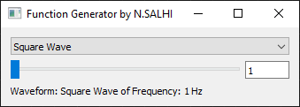
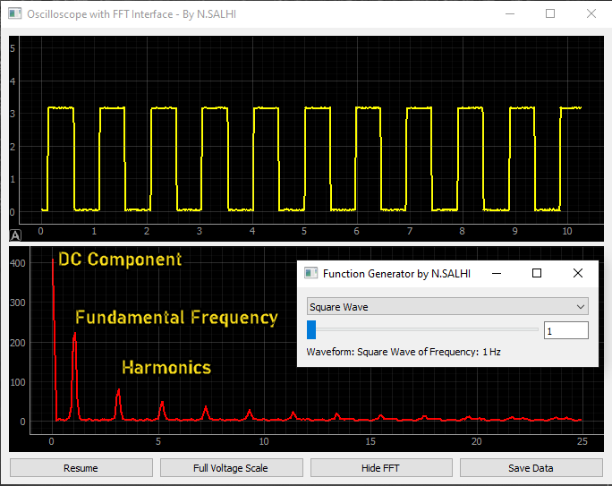
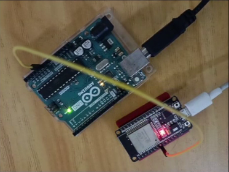
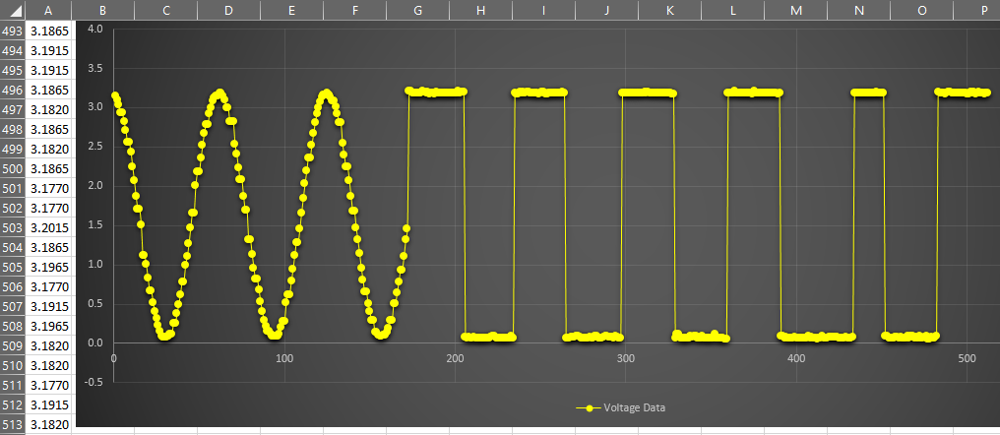

# **How to Build a Serial Frequency Generator and Oscilloscope with PyQt5, ESP32, and Arduino**

As an embedded engineer, I enjoy creating real-time tools that simplify workflows. This project combines a **Serial Frequency Generator** and an **Arduino Oscilloscope** using PyQt5, ESP32, and Arduino, providing powerful tools for signal generation and visualization.

---

## **Project Overview**
This project consists of two main applications:

### **1. Serial Frequency Generator**
- Generates customizable signals, including adjustable frequency, waveform, and amplitude.
- Built with **PyQt5**, with an intuitive GUI for controlling an **ESP32**.
- Includes an onboard LED on the ESP32 for real-time visual feedback of the signal.



*Screenshot of the Serial Frequency Generator application GUI.*

---

### **2. Arduino Oscilloscope**
- Captures and displays real-time signals generated by the Serial Frequency Generator.
- Built with **PyQt5**, with an intuitive GUI for data visualization using an **Arduino Uno**.
- Provides engineers with an accessible tool for signal analysis.



*Screenshot of the Arduino Oscilloscope application GUI.*

---

## **Hardware Setup**
The hardware setup connects the ESP32 (for signal generation) and the Arduino Uno (for signal visualization) directly via jumper wires. This simple configuration bridges signal generation and analysis.



*Live demonstration of the hardware setup for the project.*

---

## **Features**
- **Real-Time Signal Generation and Analysis**: Quickly generate and visualize signals for testing and debugging.
- **Customizable Parameters**: Modify signal frequency, amplitude, and waveform through an intuitive GUI.
- **Saved Data Support**: Analyze saved signals for post-experiment review.



*Example of saved data visualized in the Oscilloscope GUI.*

---

## **Video Demonstration**
Watch both applications in action in this short demonstration:

[](https://www.youtube.com/watch?v=X13B3740r2U)

---

## **Getting Started**
1. **Clone the Repository**:
   ```bash
   git clone https://github.com/salhina/serial-frequency-generator-oscilloscope.git
   cd serial-frequency-generator-oscilloscope
   
   ```
   
2. **Install Dependencies**
- Python 3.8+
- PyQt5
- Arduino IDE

3. **Run the Applications**
   - Open and run the Serial Frequency Generator application on your PC.
   - Upload the Arduino Oscilloscope firmware to your Arduino Uno.

